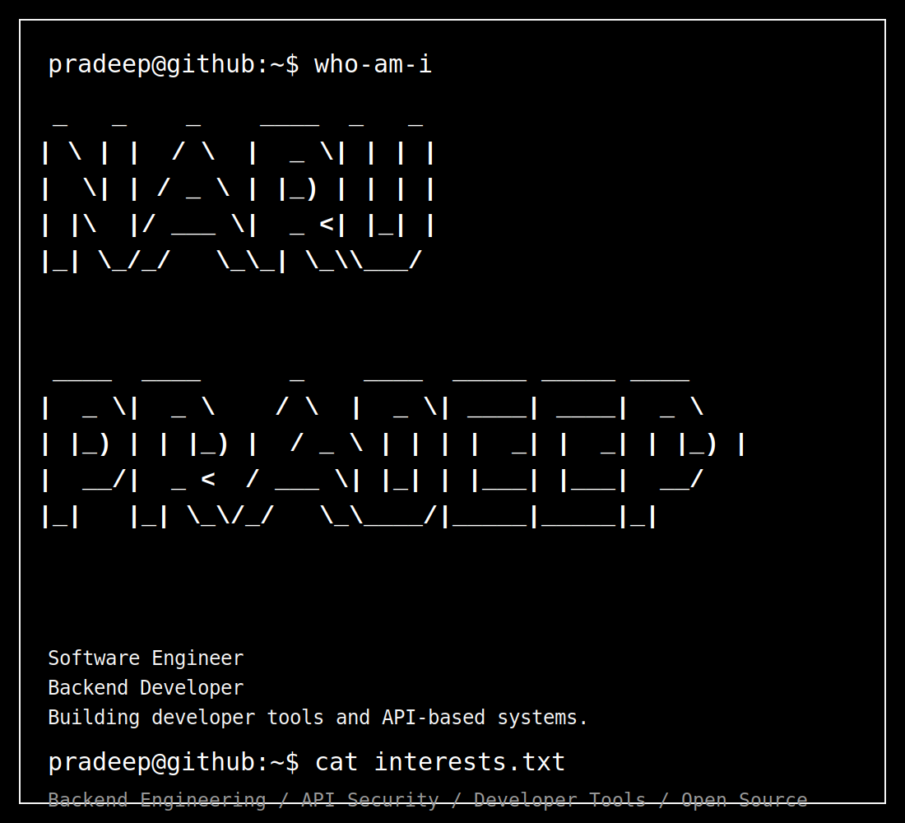
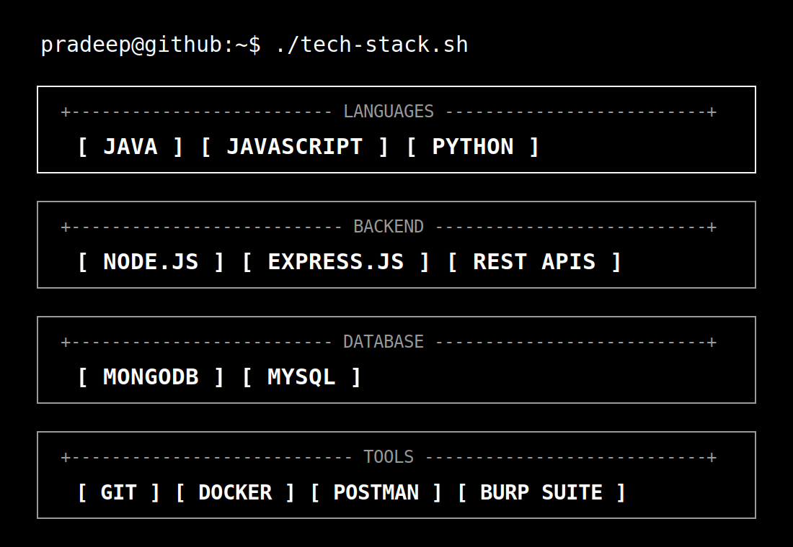
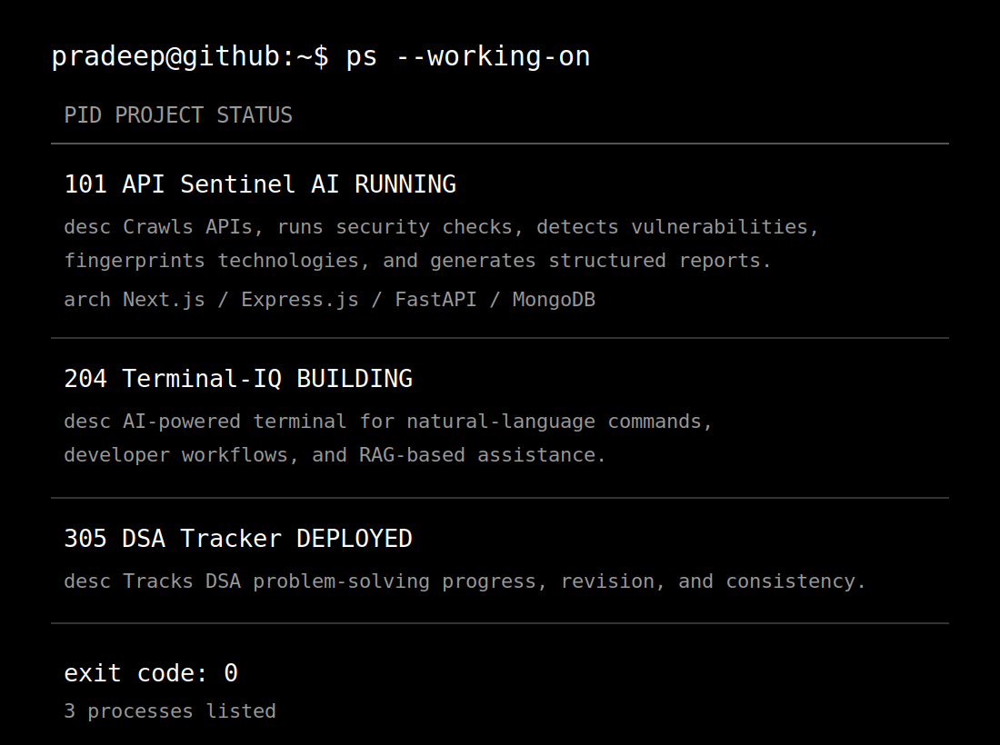
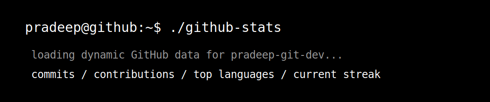
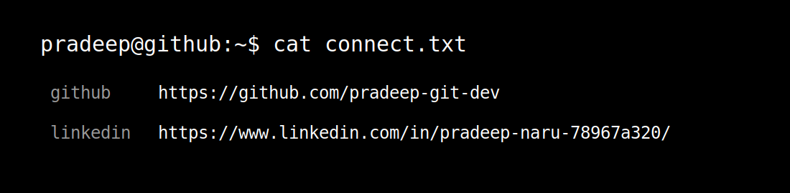

  

  

  

  

  

  

  

  

  <a href="https://github.com/pradeep-git-dev"><code>github.com/pradeep-git-dev</code></a>
   
  <a href="https://www.linkedin.com/in/pradeep-naru-78967a320/"><code>linkedin.com/in/pradeep-naru-78967a320</code></a>

  

